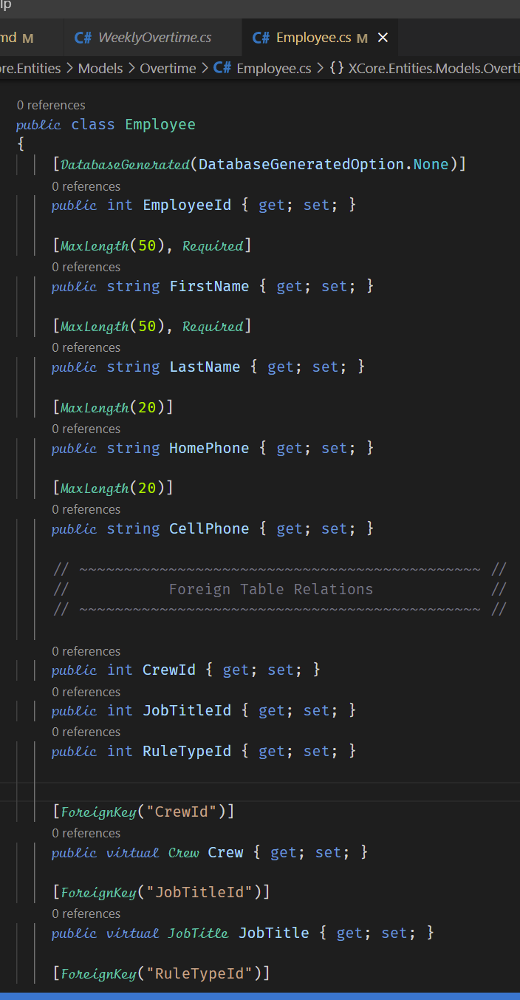
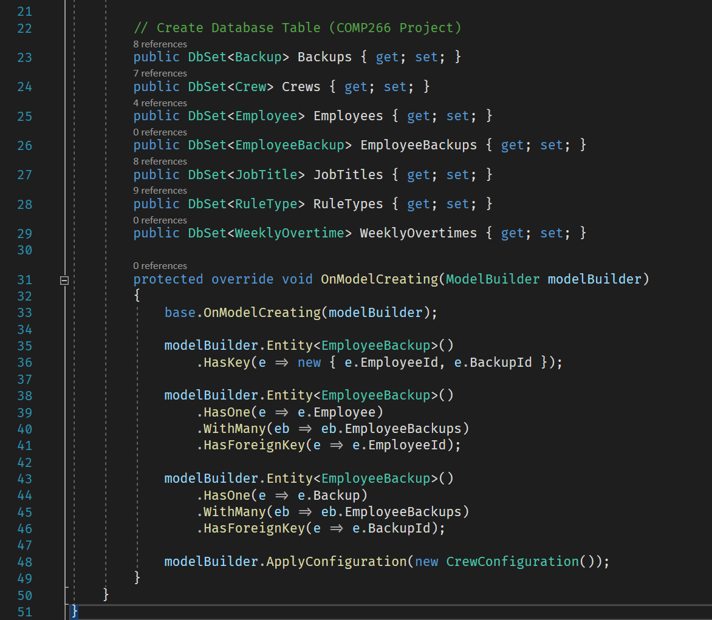
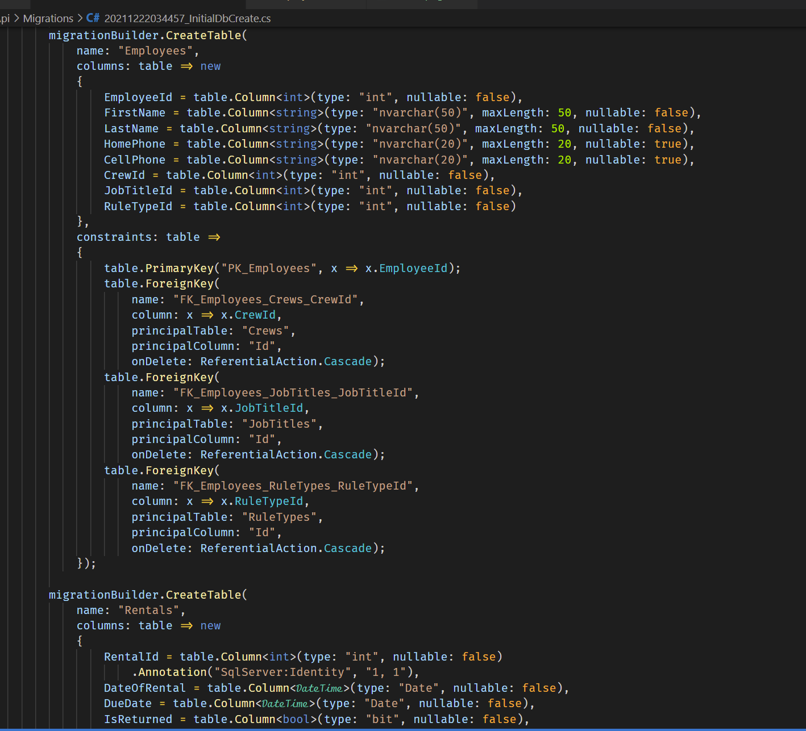
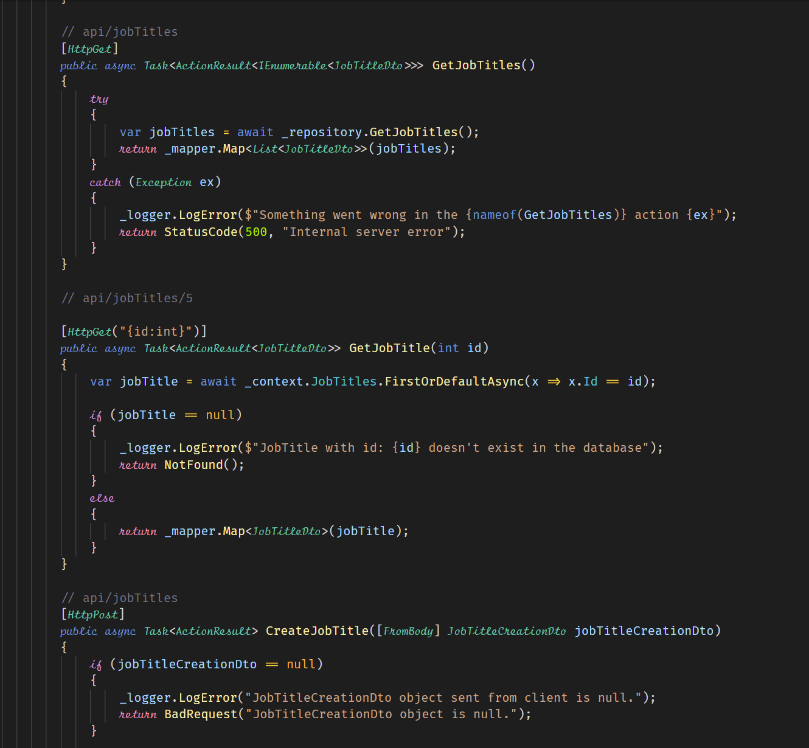
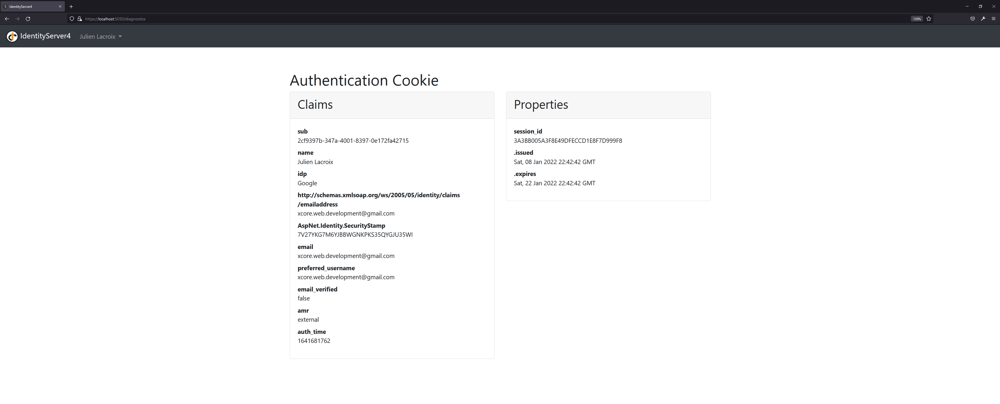
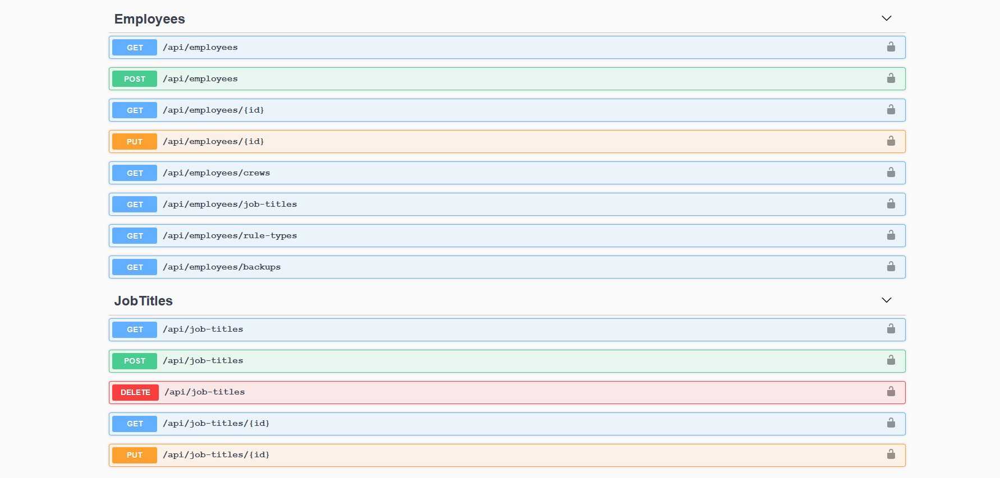

# X-Core Web Api (Asp.Net Core C# Backend)

Project still under development, MVC Project

## Documentation

- Backend built with C# (Asp.Net Core 5)
- Implemented Identity Server 4
- Database MSSQL Server Express
- Swagger and NLog
- Configured SMTP (Mailkit) for generating email for authentication process

```diff
- Front-End being rebuilt with Angular
- Will need to configure SPA for Front-End
```

### Models (M)

- Built with entity framework code first
- Add migrations to MSSQL (Express)









### Views (V)

- Project being re-built with Angular
- Link below to the front-end repository
- https://github.com/flynstone/XCore/tree/main/XCore.Api/xcore-client


### Controllers (C)

- Working with data transfer objects, and nlog to keep records of errors



### External login provider (Google)


### Swagger

- More details comming..




