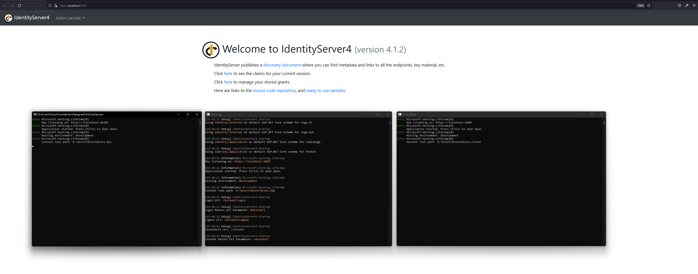
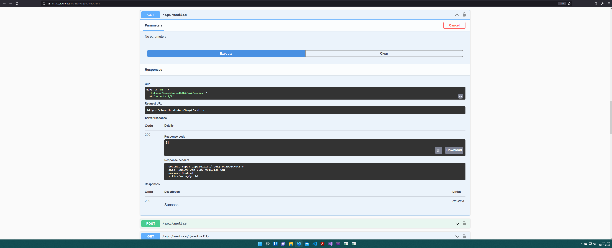
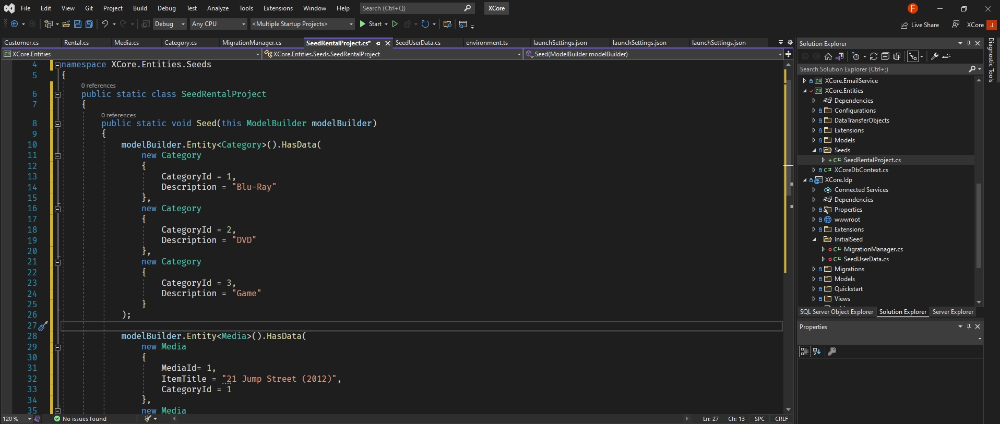
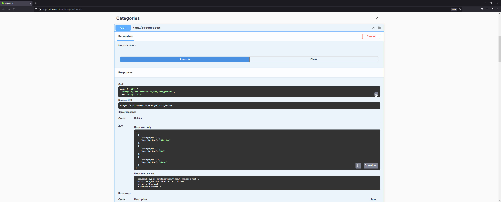

# X-Core Web Api (Asp.Net Core C# Backend)

Project still under development, MVC Project

## Documentation

- Backend built with C# (Asp.Net Core 5) => https://docs.microsoft.com/en-us/aspnet/core/?view=aspnetcore-5.0
- Implemented Identity Server 4          => https://identityserver4.readthedocs.io/en/latest/
- Database MSSQL Server Express          => https://www.microsoft.com/en-ca/sql-server/sql-server-2019
- Swagger                                => https://swagger.io/
- NLog                                   => https://nlog-project.org/
- SMTP (Mailkit)                         => https://github.com/jstedfast/MailKit

```diff
- Front-End being rebuilt with Angular 12
```

### Backend Servers
- Screen shot of the 3 backend servers running



### Models (M)

- Built with entity framework code first
- Add migrations to MSSQL (Express)


### Views (V)

- Project being re-built with Angular
- Link below to the front-end repository
- https://github.com/flynstone/XCore/tree/main/XCore.Api/xcore-client


### Controllers (C)

- Working with data transfer objects, automapper and nlog


### External login provider (Google)


### Swagger


## Progress

- Testing backend routing before connecting the front-end. I realized I forgot to seed the database when restoring it. (Due to physical host hardware failure)



- Seeding Rental Project



- Fetching seeds with swagger



- Currently working on front-end https://github.com/flynstone/XCore/tree/main/XCore.Api/xcore-client


